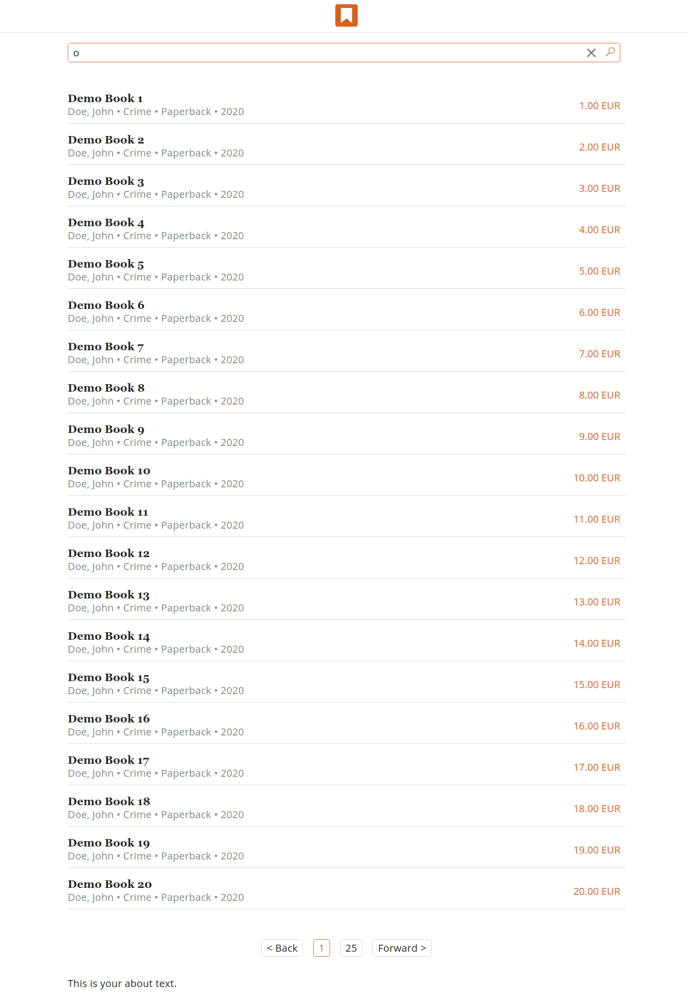

# incwadi/find

incwadi is a book database to manage your books.



## Requirements

- NodeJS 12LTS
- Yarn

## Getting Started

Download the files from the repository.

```shell
git clone https://github.com/abaldeweg/incwadi_find.git
```

Create the `.env` file with the following content. Please fit it to your needs.

```shell
API=URL
COLOR10=false
COLOR05=false
COLOR00=false
LOGO=src/assets/logo.png # set to false for default logo
LOCALE=en
ABOUT=<p>This is your about text!<p>
```

Start the build process.

```shell
yarn build
```

The files in `dest/` should be located in your web root.

Configure your webserver to redirect all requests to the `index.html` file.

Example for Apache

```apache
<IfModule mod_rewrite.c>
  RewriteEngine On
  RewriteBase /
  RewriteRule ^index\.html$ - [L]
  RewriteCond %{REQUEST_FILENAME} !-f
  RewriteCond %{REQUEST_FILENAME} !-d
  RewriteRule . /index.html [L]
</IfModule>
```

## Update

Remove the old files and download the new ones like you would install the app.

```shell
bin/update
```

## CLI

- yarn build - Builds the app.
- yarn watch - Starts the development environment.
- yarn test - Runs the unit tests.
